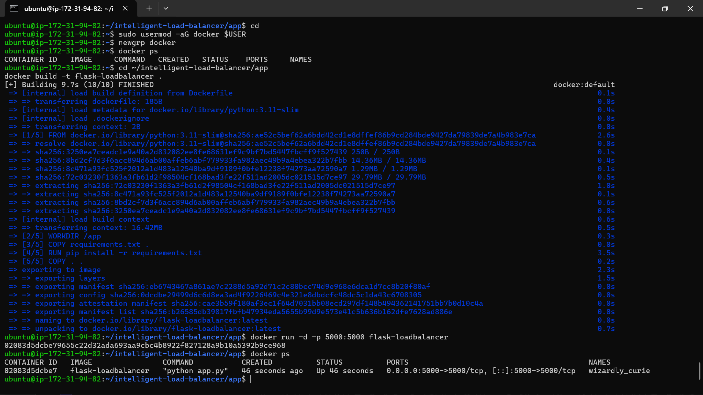
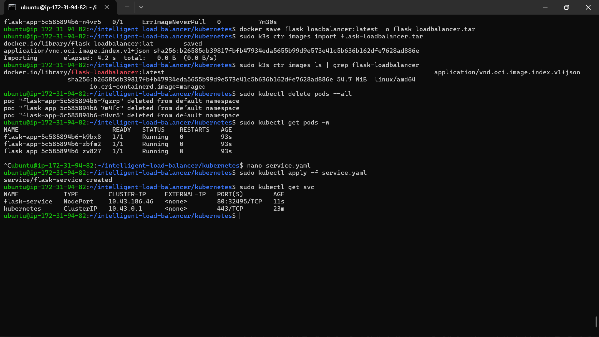
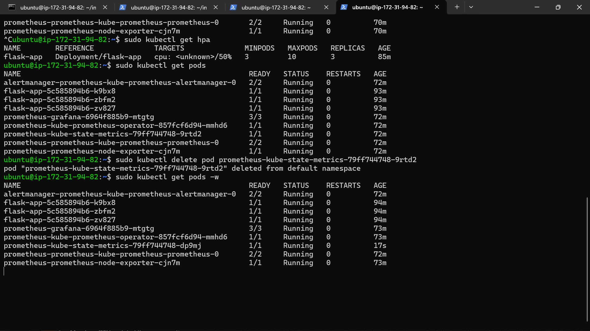
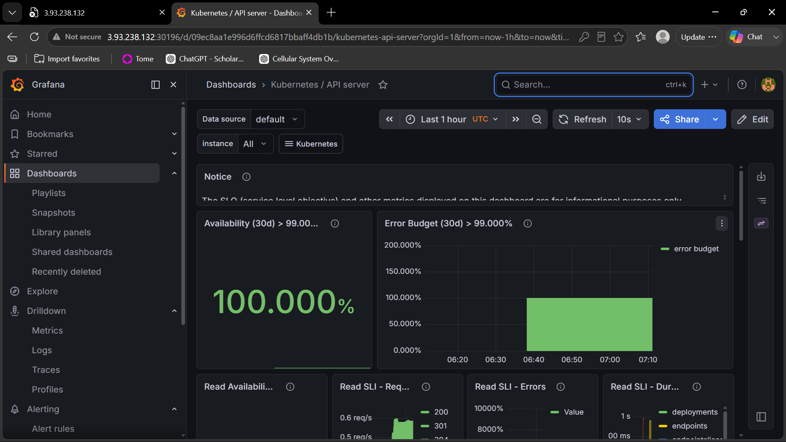
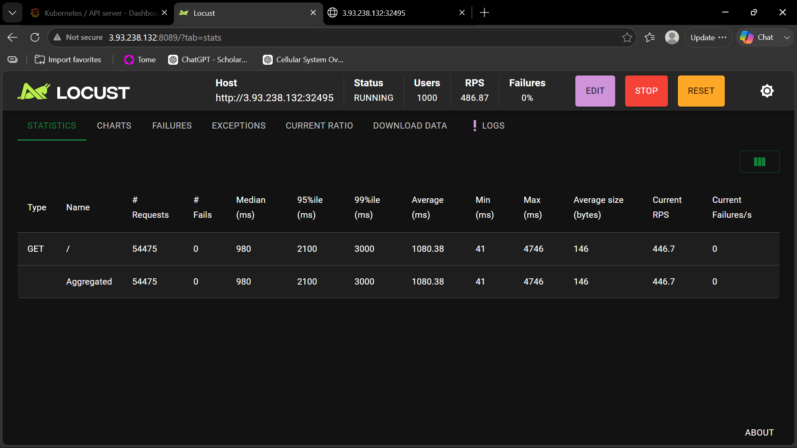

# Intelligent Load Balancing System with Auto-Scaling and Real-Time Monitoring

## Overview
This project demonstrates a cloud-native application deployed on AWS using Docker, Kubernetes (k3s), Prometheus, Grafana, and Horizontal Pod Autoscaler (HPA).

## Technologies Used
- AWS EC2 (Ubuntu)
- Python Flask
- Docker
- Kubernetes (k3s)
- Prometheus
- Grafana
- Helm
- Locust

## Features
- Containerized Flask application
  
- Kubernetes Deployment
  
- Auto Scaling using HPA
  
- Real-Time Monitoring
  
- Load Testing with Locust
  
- Self-Healing Pods

## Project Structure

```
intelligent-load-balancer/
├── app/
├── kubernetes/
├── monitoring/
├── nginx/
├── load-testing/
└── README.md
```

## Deployment

1. Build Docker Image
2. Deploy to Kubernetes
3. Expose Service
4. Configure HPA
5. Install Prometheus & Grafana
6. Perform Load Testing

## Author

Armaandeep Singh
B.Tech CSE
I.K. Gujral Punjab Technical University
